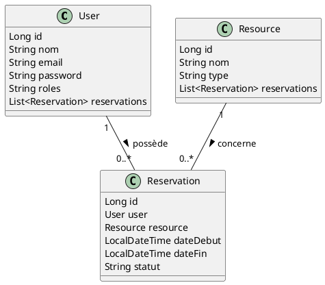

# RanBlanc – Système de Réservation de Ressources

## 📝 Description Générale

**RanBlanc** est une plateforme de réservation de ressources partagées (salles, voitures, etc.) via une API REST sécurisée. Elle permet à plusieurs utilisateurs de réserver des ressources de manière concurrente, tout en évitant les conflits et les doubles réservations.

---

## 👥 Acteurs & Cas d'Utilisation

### Acteurs principaux
- **Administrateur** :
    - Gère les utilisateurs, les ressources, visualise toutes les réservations.
- **Client** :
    - S'inscrit, se connecte, réserve une ressource, consulte/annule ses réservations.

### Cas d'utilisation (User Stories)
- Un client peut s'inscrire et se connecter.
- Un client peut réserver une ressource disponible pour une période donnée.
- Un client ne peut pas réserver une ressource déjà prise sur le même créneau.
- Un administrateur peut ajouter/supprimer des ressources et des utilisateurs.
- Un administrateur peut voir toutes les réservations.
- Les réservations expirées sont automatiquement nettoyées.

---

## 🧱 Architecture & Diagramme de Classe

### Structure des packages

```
src/main/java/com/ranblanc/
├── config/         # Configuration Swagger/OpenAPI
├── controller/     # Contrôleurs REST
├── dto/            # Objets de transfert de données
├── entity/         # Entités JPA (User, Resource, Reservation)
├── exception/      # Gestion globale des exceptions
├── mapper/         # Mapping entité <-> DTO
├── repository/     # Accès aux données (JPA)
├── scheduler/      # Tâches planifiées (nettoyage)
├── security/       # Sécurité (Spring Security, UserDetails)
├── service/        # Logique métier
└── DataInitializer.java # Insertion de données de base
```

### Diagramme de classe (PlantUML)



---

## 🚀 Fonctionnalités principales

- **Inscription & Connexion** (rôle client par défaut)
- **Gestion des utilisateurs** (admin)
- **Gestion des ressources** (admin)
- **Réservation de ressources** (client/admin)
- **Annulation de réservation** (client/admin)
- **Nettoyage automatique des réservations expirées** (scheduler)
- **Documentation Swagger** (API interactive)
- **Sécurité** : Authentification, rôles, accès restreint
- **Gestion de la concurrence** : Empêche les conflits de réservation

---

## ⚠️ Problème de Concurrence & Solution

### Problème
Plusieurs utilisateurs peuvent tenter de réserver la même ressource au même moment, ce qui peut provoquer des conflits (double réservation).

### Solution technique
- **Vérrouillage (synchronisation)** : La méthode de réservation est synchronisée pour éviter les accès concurrents.
- **Sémaphore** : Limite le nombre d'accès simultanés à la section critique.
- **Vérification de conflit** : Avant chaque réservation, le service vérifie qu'aucune réservation existante ne chevauche la période demandée.

**Extrait de code :**
```java
public synchronized ReservationDTO reserver(ReservationDTO dto) throws Exception {
    semaphore.acquire();
    try {
        // Vérification de conflit
        boolean conflit = reservationRepository.existsByResourceAndDateDebutLessThanEqualAndDateFinGreaterThanEqual(
                resource, dto.getDateFin(), dto.getDateDebut());
        if (conflit) {
            throw new IllegalStateException("Conflit de réservation détecté !");
        }
        // Création de la réservation
    } finally {
        semaphore.release();
    }
}
```

---

## 🛠️ Technologies & Outils

- **Backend** : Spring Boot 3, Spring Data JPA, Spring Security, Spring Scheduler
- **Base de données** : MySQL (XAMPP ou autre)
- **Documentation** : Swagger (springdoc-openapi)
- **Lombok** : Réduction du code boilerplate
- **Gestion de la concurrence** : Java Concurrency (synchronized, Semaphore)
- **Tests** : JUnit (à compléter)
- **Gestion des exceptions** : @RestControllerAdvice

---

## ⚙️ Installation & Exécution

### Prérequis
- Java 17+
- Maven
- MySQL (XAMPP conseillé)
- (Optionnel) Postman ou Swagger UI pour tester l'API

### Configuration de la base de données

Dans `src/main/resources/application.properties` :
```
# Configuration MySQL (XAMPP)
spring.datasource.url=jdbc:mysql://localhost:3306/ranblanc_db?characterEncoding=utf8&connectionCollation=utf8mb4_unicode_ci
spring.datasource.username=root
spring.datasource.password=
spring.datasource.driver-class-name=com.mysql.cj.jdbc.Driver

# JPA/Hibernate
spring.jpa.hibernate.ddl-auto=update
spring.jpa.show-sql=true
spring.jpa.properties.hibernate.dialect=org.hibernate.dialect.MySQLDialect

# Encodage UTF-8 (optionnel, déjà couvert par l'URL)
spring.datasource.hikari.connection-init-sql=SET NAMES utf8mb4 COLLATE utf8mb4_unicode_ci
```

### Lancer l'application

```bash
mvn clean install
mvn spring-boot:run
```

### Accéder à la documentation API

- Swagger UI : [http://localhost:8080/swagger-ui.html](http://localhost:8080/swagger-ui.html)

### Comptes de test

- **Administrateur**
    - email : `admin@ranblanc.com`
    - mot de passe : `admin123`
- **Client**
    - email : `client@ranblanc.com`
    - mot de passe : `client123`

---

## 📚 Exemples d'utilisation de l'API

- **Inscription** : `POST /api/users/register`  
  Body : `{ "nom": "Jean", "email": "jean@email.com", "password": "monmotdepasse" }`
- **Connexion** : Basic Auth ou `POST /api/users/login`
- **Réserver une ressource** : `POST /api/reservations`
- **Annuler une réservation** : `DELETE /api/reservations/{id}`

---

## 📈 Évolutions possibles

- Ajout d'un front-end (Angular, React)
- Notifications email
- Gestion avancée des rôles
- Statistiques d'utilisation

---

## 🏷️ Licence

Projet open-source, usage libre pour l'éducation et la démonstration.
